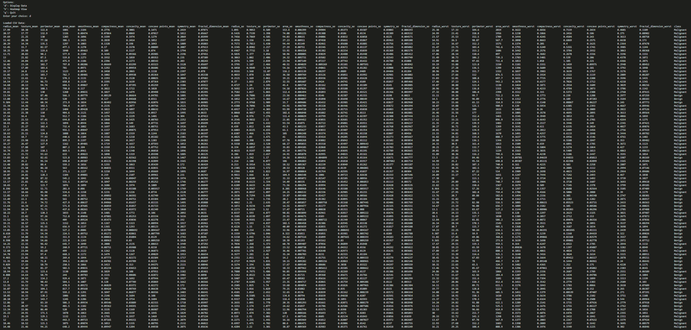
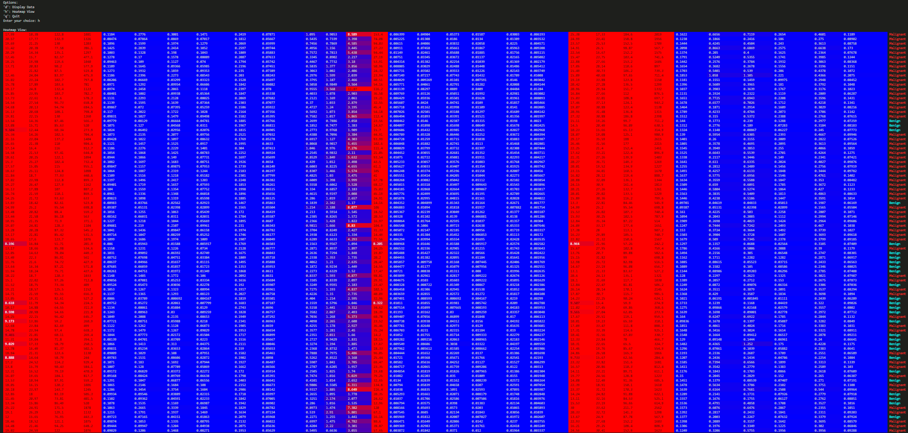

# TermTabDataTool

Terminal-based tabular (CSV) dataset tool written in C to experiment with handling large multidimensional datasets.

## How to use

1. Clone the repository
2. Run `make run` to compile and run the program

## Screenshot

Default display:

Heatmap display:

## License

This project is licensed under the MIT License. See the [LICENSE](LICENSE) file for details.
